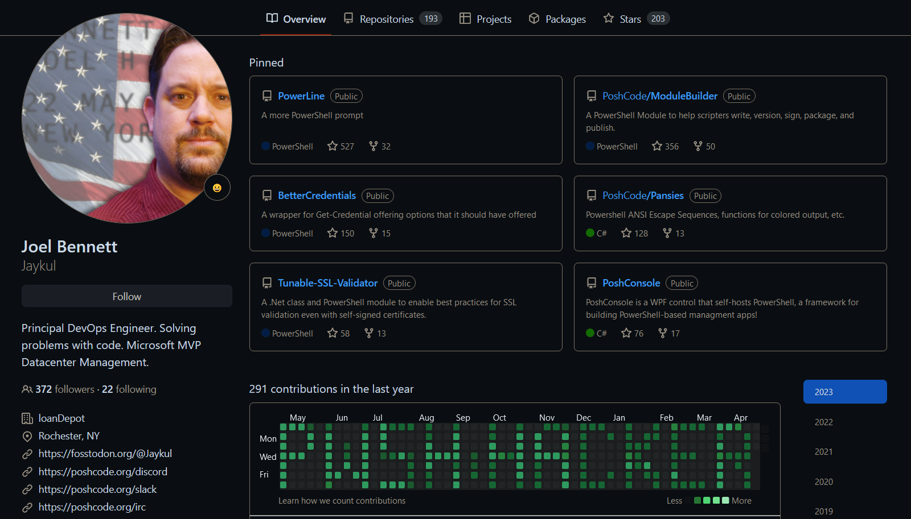

# Tempting Fate {.r-fit-text}

## Patterns & Practices

### Sharable Scripts and Functions

<https://github.com/Jaykul/DevOps2023>

Joel "Jaykul" Bennett

note: Welcome everyone to "Tempting Fate: Patterns and Practices for sharable scripts and functions" ... this is an update of talk I gave back in 2019. Back then, I called it "Bullet-Proofing" and everything went rather hysterically badly.
<br/>
This year, I brought two laptops, and hopefully, we'll get through the whole thing without borrowing a laptop from the audience.
<br/>
I am, of course, Joel Bennett.

<!-- .slide: data-background="url(images/ccbysa.png) bottom 10px left 200px/auto 80px no-repeat, url(images/summit.png) bottom 10px right 10px/auto 80px no-repeat, url(images/pshsummit.svg) bottom 10px left 65%/30% 80px no-repeat, url(images/background.jpg) bottom 0px left 0px/100% 100px no-repeat" -->

---

note: For those of you who came to this talk despite not knowing me, thank you, and let me introduce myself. I'm Joel Bennett, I'm from upstate New York by way of the grasslands of Guanacaste, Costa Rica. I have been "Jaykul" (pronounced J. Cool) online since the 1990s, and I'm currently the Principal DevOps Engineer at loanDepot! I've been a Microsoft PowerShell MVP for 14 years, an open source programmer for 25 years, a Christian for uhm, let's go with "over 40 years," and bilingual for, well ... longer than that.


# About Me

- Joel "Jaykul" Bennett
- Principal DevOps Engineer @ loanDepot
- [PoshCode.org](https://PoshCode.org): [/discord](https://discord.gg/PowerShell), [/slack](https://poshcode.org/slack), [/irc](https://poshcode.org/irc)
- [fosstodon.org/@jaykul](https://fosstodon.org/@jaykul) (and [Twitter](https://twitter.com/Jaykul))
- [github.com/Jaykul](https://github.com/Jaykul) (also [PoshCode](https://github.com/PoshCode))




<!-- .slide: data-background="url(images/ccbysa.png) bottom 10px left 200px/auto 80px no-repeat, url(images/summit.png) bottom 10px right 10px/auto 80px no-repeat, url(images/pshsummit.svg) bottom 10px left 65%/30% 80px no-repeat, url(images/background.jpg) bottom 0px left 0px/100% 100px no-repeat"
-->
--

<!-- .slide: data-background="url(images/github.png) bottom 0px left 0px/100% 100% no-repeat" -->

note: You can find me on Discord (I've been running that PowerShell community on IRC, Slack and Discord for 15 or 16 years -- can I get a shout-out from anyone who's joined us and found helpful people?). You can also find me on Mastodon, and Twitter (sometimes), as well as on GitHub. I'm always happy to talk about PowerShell, Programming, DevOps, Software Design, etc.

---

# Shareable Code {.r-fit-text}

## What makes code shareable? {.r-fit-text}

note: For what it's worth: I've been doing "devops" for a while, but I still think of myself as a programmer. A developer or a hacker, but not an architect. At Iron Scripter, I was "Battle Faction."
<br/>I **am** going to be talking a lot about design today, but I want you to keep in mind that the only reason we're putting this much thought into our design is to make sure that our work is usable by _other people_.
<br />What do YOU think makes code shareable? What does it take for you to post a snippet on our Virtual User Group, Github or StackOverflow? Do you have different standards when you're asking a question than when you're answering one?

<!-- .slide: data-background="url(images/ccbysa.png) bottom 10px left 200px/auto 80px no-repeat, url(images/summit.png) bottom 10px right 10px/auto 80px no-repeat, url(images/pshsummit.svg) bottom 10px left 65%/30% 80px no-repeat, url(images/background.jpg) bottom 0px left 0px/100% 100px no-repeat" data-auto-animate -->

---

# Shareable Code

1. Code that won't embarrass you

note: This is the first thing, right? If you are embarrassed of it, you're not going to share. Now, I don't know about y'all, but remember: I'm Battle Faction. To me, code that doesn't embarrass me is not about "pretty" code -- it just means code that works, or that produces useful errors when it doesn't work.

<!-- .slide: data-background="url(images/ccbysa.png) bottom 10px left 200px/auto 80px no-repeat, url(images/summit.png) bottom 10px right 10px/auto 80px no-repeat, url(images/pshsummit.svg) bottom 10px left 65%/30% 80px no-repeat, url(images/background.jpg) bottom 0px left 0px/100% 100px no-repeat" data-auto-animate -->

---

# Shareable Code

1. Code that won't embarrass you
2. Commands that others can figure out

note: Commands that people can figure out. Ideally, that they can figure out _without reading the code_. This basically means: good names for commands and parameters, the right parameters, and "enough" help.

<!-- .slide: data-background="url(images/ccbysa.png) bottom 10px left 200px/auto 80px no-repeat, url(images/summit.png) bottom 10px right 10px/auto 80px no-repeat, url(images/pshsummit.svg) bottom 10px left 65%/30% 80px no-repeat, url(images/background.jpg) bottom 0px left 0px/100% 100px no-repeat" data-auto-animate -->

---

# Shareable Code

1. Code that won't embarrass you
2. Commands others can figure out
3. Modules that work together

note: Finally, I prefer to share modules: collections of commands that work together. I want people who aren't to be able to guess which ones to use together. I'm not going to spend any time picking on other developers today, but if a reasonable person picks up your module and wants to pipe A into B, and it doesn't work, that's a problem (see "desire paths" on your favorite image search).

<!-- .slide: data-background="url(images/ccbysa.png) bottom 10px left 200px/auto 80px no-repeat, url(images/summit.png) bottom 10px right 10px/auto 80px no-repeat, url(images/pshsummit.svg) bottom 10px left 65%/30% 80px no-repeat, url(images/background.jpg) bottom 0px left 0px/100% 100px no-repeat" data-auto-animate -->

---

### Code that won't embarrass you {.r-fit-text}

#### Error Handling

- Usually that means catch and release
- Wrap **everything** in try/catch
- Normal use shouldn't produce errors
- It's ok not to handle every edge case

note: THe first aspect of code that won't embarrass you is error handling. Obviously in PowerShell it's relatively acceptable to let errors just come out of your command. However, you should do that by catching and re-throwing, not just ignoring. There are a lot of details we could get into about why (sometimes exception only show up _when_ there's a try/catch), but this is not an error-handling talk, it's a patterns and practices talk so I can just say:
<br/> Follow this template...

<!-- .slide: data-background="url(images/ccbysa.png) bottom 10px left 200px/auto 80px no-repeat, url(images/summit.png) bottom 10px right 10px/auto 80px no-repeat, url(images/pshsummit.svg) bottom 10px left 65%/30% 80px no-repeat, url(images/background.jpg) bottom 0px left 0px/100% 100px no-repeat" -->

--

## Code Template

```PowerShell
function Test-Function {
    <# help here #>
    [CmdletBinding()]param()
    process {
        try {
            <# code here #>
        } catch {
            throw $_
        }
    }
}

```

note: Follow this template, and add custom handling when you want to handle or suppress errors, turn them into warnings, or convert terminating exceptions into non-terminating errors or vice-versa. There could be more to this template (and there will be, later), but for the moment, the point is to start with a try/catch wrapped around the inside of your process block (and your begin and end blocks too, if you need them).
<br/>
At a bare minimum, you're going to rethrow. That's to make sure that you don't get surprised by exceptions if someone wraps your code. I actually encourage you to test your code with `-ErrorAction Stop`, to help you identify potential problems.
<br/>
Remember, this is the last stand -- you can't really do much to _recover_ here.
<br/>
Ok, let's look a real-world example: What happens if something in your `prompt` function has an error or throws an exception?

<!-- .slide: data-background="url(images/ccbysa.png) bottom 10px left 200px/auto 80px no-repeat, url(images/summit.png) bottom 10px right 10px/auto 80px no-repeat, url(images/pshsummit.svg) bottom 10px left 65%/30% 80px no-repeat, url(images/background.jpg) bottom 0px left 0px/100% 100px no-repeat" -->

--

## Demo 1

### Not handling errors appropriately

```PowerShell
function prompt {
    Write-Error "Typo"
    "$pwd> "
}

function prompt {
    Write-Error "Typo"
    "$pwd> "
    throw "water balloon"
}
```

What happens if something in your `prompt` function has an error or throws an exception?

note: If we run these ...
<br />First, we can see that _errors are just ignored_,
<br />But when the prompt throws an exception, PowerShell ignores any output it's _already gotten_ and gives you the minimalist prompt instead
<br />You're expected to _just know_ that this prompt means you should `Get-Error` and figure out what happened
<br />(oh, someone threw a water balloon, classic).

<!-- .slide: data-background="url(images/ccbysa.png) bottom 10px left 200px/auto 80px no-repeat, url(images/summit.png) bottom 10px right 10px/auto 80px no-repeat, url(images/pshsummit.svg) bottom 10px left 65%/30% 80px no-repeat, url(images/background.jpg) bottom 0px left 0px/100% 100px no-repeat" -->

--

## Demo 2

### Handling errors appropriately

```PowerShell
Set-PowerLinePrompt

$prompt

Add-PowerLineBlock { Write-Error "Typo"}

Add-PowerLineBlock { throw "grenades" }

$PromptErrors

$PromptErrors[1] | Select *

$prompt.Remove($prompt[-1])
$prompt.Remove($prompt[-1])
```

note: Let me show you what PowerLine does in that situation. PowerLine is my prompt module...
<br />With PowerLine, your prompt becomes `$prompt`, a list of script blocks. So let's try the same thing, and see what happens when you add an exception ...
<br />
You can see I actually still got my prompt! But I also got a warning and we can see that it's telling me how to _hide_ the error if I really want to do that...
<br />
Of course, I don't really want to hide the errors.
<br />
If I throw an exception, it gets logged right along with the error, and we can look at both of them in `$PromptErrors`. Notice that it tells us which block caused each problem, and of course, in this case, we can just remove those blocks.
<br />
The point is: I couldn't fix the error, but I could "handle" it, not crash, and give you enough information so that _you_ can resolve the error.

<!-- .slide: data-background="url(images/ccbysa.png) bottom 10px left 200px/auto 80px no-repeat, url(images/summit.png) bottom 10px right 10px/auto 80px no-repeat, url(images/pshsummit.svg) bottom 10px left 65%/30% 80px no-repeat, url(images/background.jpg) bottom 0px left 0px/100% 100px no-repeat" -->

--

## Sharing is Caring

(Log Everything)

```PowerShell
try {
    Write-Information "Enter Process $MyInvocation" -Tag Trace
    <# code here #>
} catch {
    Write-Information $_ -Tag Exception
    throw $_
}
```

Invoke it with `-Iv drip` or `6>log.ans`

```PowerShell
& '.\03. logging.ps1' -Iv drip -infa 2
$drip |
    Where Tag -Contains Exception |
    Export-CliXml exception.logx
```

note: One last point about not embarrassing ourselves. When there are problems, we want to make it as simple as possible for people to find where the problem is. How? (Make it possible to) _log_ everything. When we're trying to track down a problem, it's extremely helpful if there are log statements for each logic block -- you know what I mean, right? Within each branch of an `if`, or each statement of a `switch`, etc.
<br/>
There are probably **better** ways to log than what I'm showing you here, but if you don't have a logging solution, you could do a lot worse than writing it to the Information stream.
<br/>
The information stream (can be) timestamped and sourced, and it's full of objects, so you can capture it with the `-InformationVariable` parameter and use Export-CliXml to dump it to a file. It's pretty straight-forward, and can even be used across remoting.
<br/>
If you want to see something really cool, check out my Information module, and run:
Set-InfoTemplate '{PSComputerName} `e[38;5;1m{ClockTime:hh:mm:ss.fff} {Indent}`e[38;5;6m{Message} `e[38;5;5m<{Command}>{ScriptName}:{LineNumber}`e[39m'
& '.\03. logging.ps1' 6>log.ans

<!-- .slide: data-background="url(images/ccbysa.png) bottom 10px left 200px/auto 80px no-repeat, url(images/summit.png) bottom 10px right 10px/auto 80px no-repeat, url(images/pshsummit.svg) bottom 10px left 65%/30% 80px no-repeat, url(images/background.jpg) bottom 0px left 0px/100% 100px no-repeat" -->

--

## In summary

- Always try/catch
    - Rethrow by default
    - Only handle specific exceptions
- Always log
    - Especially exceptions
    - Information stream counts

note: OK, just before we go back to design, I want to just summarize this a little: the point here is that you should always try/catch, even if you're just rethrowing.
And (especially if you're suppressing exceptions), you should log the path of execution, so when something unexpected happens, you have the ability to say: look, this is what happened...
OK, Now, let's improve the design...

<!-- .slide: data-background="url(images/ccbysa.png) bottom 10px left 200px/auto 80px no-repeat, url(images/summit.png) bottom 10px right 10px/auto 80px no-repeat, url(images/pshsummit.svg) bottom 10px left 65%/30% 80px no-repeat, url(images/background.jpg) bottom 0px left 0px/100% 100px no-repeat" -->

---

<!-- .slide: data-background="url(images/ccbysa.png) bottom 10px left 200px/auto 80px no-repeat, url(images/summit.png) bottom 10px right 10px/auto 80px no-repeat, url(images/pshsummit.svg) bottom 10px left 65%/30% 80px no-repeat, url(images/background.jpg) bottom 0px left 0px/100% 100px no-repeat" -->

## Commands others can figure out {.r-fit-text}

- Intuitive and discoverable
- Play well with others
- **It's about good interfaces**

Let's talk about how we decide what to write!

note: So. I told you that shareable code was about writing commands that make sense, and work together.
<br/> What that means is that it's about designing good interfaces.
<br/> Like I said before: commands people can use even without reading the help, and
<br/> commands which work well _with other commands_,
<br/> Let's talk about the process.
<br/>
I know I said I was Battle Faction ... but the truth is I'm really never quite happy with a module until the commands can pipe into each other, and the number of nouns has been reduced as far as is comfortable. I don't worry too much about total newbies, but I want to write commands that people with some PowerShell experience can pick up and use intuitively.
<br/>
To design sharable commands, we need to think about how they'll be used

--

## How will it be used?

- How do you want to call it
- What parameters do you want to pass
- Where will you get those values
- What are you doing with the output

note: You're going to brainstorm, in a sense: How do you want to use it, or how do you think other people will use it. What commands exist which people might want to use it _with_. Where are you getting the values for your parameters? What are you doing with the output? Are you passing it to another command, formatting it for display?
<br />
Now, our goal is to design the command to make these scenarios that you come up with easier.
<br />
The best practice is to start by writing down concrete examples of your answers to these questions, in pseudo code. It will help you get a feel for how you expect the command to work. When you do that, write them like this ...

<!-- .slide: data-background="url(images/ccbysa.png) bottom 10px left 200px/auto 80px no-repeat, url(images/summit.png) bottom 10px right 10px/auto 80px no-repeat, url(images/pshsummit.svg) bottom 10px left 65%/30% 80px no-repeat, url(images/background.jpg) bottom 0px left 0px/100% 100px no-repeat" -->

--

## Write down your examples

```PowerShell
function Import-Configuration {
<#  .SYNOPSIS
        A command to load configuration for a module
    .EXAMPLE
        $Config = Import-Configuration

        Load THIS module's configuration from a command
    .EXAMPLE
        $Config = Import-Configuration
        $Config.AuthToken = $ShaToken
        $Config | Export-Configuration

        Update a single setting in the configuration
#>
```

note: When you start writing out the concrete examples, write them like this ...
<br />Hopefully, you recognize this as comment-based help for the command -- and I'm very serious. The first thing you should do when you start writing a command, is write the help.
<br />Not all the help, but ...
<br />When you start writing down your ideas about how you're going to use the command, it can help you to visualize what you're going to be doing with the command, and that helps you think about the necessary parameters, what the output needs to be, etc.
<!-- .slide: data-background="url(images/ccbysa.png) bottom 10px left 200px/auto 80px no-repeat, url(images/summit.png) bottom 10px right 10px/auto 80px no-repeat, url(images/pshsummit.svg) bottom 10px left 65%/30% 80px no-repeat, url(images/background.jpg) bottom 0px left 0px/100% 100px no-repeat" -->

---

## First, write help

We **require** three things in the help:

1. A synopsis and/or a short description
2. Examples -- for every parameter set
3. Documentation for each parameter

note: I like to talk about the **help you can't not write**. That's three things:
<br />
<br />1. A Synopsis
<br />
    First we need a synopsis or short description of the command. That's all it takes for the help system to engage, but describing it in a sentence can also help you to start thinking about the command: what it's job is, and what it's job is not.
<br />
    I encourage you to also write a full description, but for now, just write a synopsis (you'd probably get the description wrong anyway at this point). The synopsis is enough to get started.
<br />
<br />2. An example -- for each parameter set
<br />
    Then we can write down our examples. At this stage, it's important that your examples aren't contrived. They should be the result of your brainstorming for how you want to use it. Each example should have an explanation of the purpose of using the command this way.
<br />
    In the simplest case, you can provide a single example (with no parameters), and a sentence explaining that this runs it with the default values (and explain what those are), and then explain what happens in that case.
<br />
    You don't need an example of every parameter, but you do need an example showing all of the _mandatory_ parameters for each parameter set.
<br />
    Now, maybe you don't know what those are yet, but these examples are long-lived, and you can update these and add more as you progress.
<br />
    It's might be worth saying that if you can't think of a real example for a parameter set -- you probably don't need that parameter set 😉.
<br />
    Long term, more examples are better, but only if they have significantly different _outcomes_. Examples showing parameters which just set properties on the output aren't necessary, because we're also going to write...
<br />
<br />3. Parameter Documentation
<br />
   Documentation for each parameter. You can write this as you add parameters, by simply putting a comment above each one. In fact, I strongly recommend you do it that way (rather than using the `.PARAMETER` marker) because it's harder to forget to write and update!
<br />
The next thing we're going to do is ...

<!-- .slide: data-background="url(images/ccbysa.png) bottom 10px left 200px/auto 80px no-repeat, url(images/summit.png) bottom 10px right 10px/auto 80px no-repeat, url(images/pshsummit.svg) bottom 10px left 65%/30% 80px no-repeat, url(images/background.jpg) bottom 0px left 0px/100% 100px no-repeat" -->

---

## Then, write tests

### Remember this is design

- Write tests as documentation
- Document your intent and design
- Prove your implementation works

note: We're going to mostly skip over testing, because that's an entirely different talk (or two or three), but let me say this:
<br />
You should approach tests as documentation. Think of them as documenting your intent, your design, and your examples, and ensuring that you don't break one of your own use cases at some point in the future.
<br />
Listen: If you're not writing tests, start. Grab Pester. Write some _acceptance tests_, and read a little about behavior-driven development.
<br />
But the bottom line is: make sure you have tests for each of the examples that we wrote above.

<!-- .slide: data-background="url(images/ccbysa.png) bottom 10px left 200px/auto 80px no-repeat, url(images/summit.png) bottom 10px right 10px/auto 80px no-repeat, url(images/pshsummit.svg) bottom 10px left 65%/30% 80px no-repeat, url(images/background.jpg) bottom 0px left 0px/100% 100px no-repeat" -->

---

## Pick good names

Once you have some help and some tests in place, stop and think _again_ about naming things.

This really is the most crucial part of your design.

Parameter names define your **user** interface, but also your **programming** interface, affecting _pipeline binding_ as well as _discoverability_.

note: I know most of you spend some time thinking about what to name your commands right? What to name your functions or scripts. It's inevitable, because there are rules in PowerShell about naming.
<br />
But you _should_ be spending even more time thinking about the names of your parameters, because parameter names are not just about users discovering how to use your command, they're also the interface by which commands interact with each other.

<!-- .slide: data-background="url(images/ccbysa.png) bottom 10px left 200px/auto 80px no-repeat, url(images/summit.png) bottom 10px right 10px/auto 80px no-repeat, url(images/pshsummit.svg) bottom 10px left 65%/30% 80px no-repeat, url(images/background.jpg) bottom 0px left 0px/100% 100px no-repeat" -->

--

## Remember our example

- So far we have one parameter
- What should I call it?
    - Module
    - ModuleInfo
    - PSModuleInfo
- Maybe `ArgumentTransformation` for strings
- What about Get-Command & Get-Module

note: Show the Import-Configuration code
<br />
    So far we have one parameter. What should it's name be?
<br />
    Personally, I'm leaning toward ModuleInfo, because I think the "PS" looks like a module prefix that I should not use, and ModuleInfo makes it clear that I'm not just looking for a module _name_.
<br />
    However, I'm considering three things:
<br />
    1. Perhaps I could write a TypeAdapter for ModuleInfo to call get-module if you pass a string name. That would mean "Module" would be a good name anyway.
    2. What sorts of objects exist in PowerShell that might have a ModuleInfo as a property? CommandInfo!  It turns out that the output of Get-Command has a `Module` property which would work for this -- so even if I name it "ModuleInfo", I'll need to alias it as "Module" for that to work.
    3. The command that returns `PSModuleInfo` is `Get-Module` and most people probably don't know the type of object it returns.

<!-- .slide: data-background="url(images/ccbysa.png) bottom 10px left 200px/auto 80px no-repeat, url(images/summit.png) bottom 10px right 10px/auto 80px no-repeat, url(images/pshsummit.svg) bottom 10px left 65%/30% 80px no-repeat, url(images/background.jpg) bottom 0px left 0px/100% 100px no-repeat" -->

--

## Good parameter names

- Recognizable and specific
- Implicitly typed
- Distinct
- Consistent

note: So what makes a good parameter name?
<br />
Obviously, it's a good name if users can tell what you want! Specifically, if a user can tell what information they need to pass to each parameter --and what form the data should take-- without needing to read the help.
<br />
So here are some guidelines for picking parameter names. Sometimes, these are going to cause conflicts in terms of not being able to meet all of them, but they are in priority order, and also -- you can use aliases to meet some of these goals.
<br />
Parameters should be:

<!-- .slide: data-background="url(images/ccbysa.png) bottom 10px left 200px/auto 80px no-repeat, url(images/summit.png) bottom 10px right 10px/auto 80px no-repeat, url(images/pshsummit.svg) bottom 10px left 65%/30% 80px no-repeat, url(images/background.jpg) bottom 0px left 0px/100% 100px no-repeat" -->

--

### Recognizable and Specific

| Good    | Better
| ----    | ------
| `$Path` | `$FilePath` or `$DirectoryPath`
| `$Name` | `$FirstName` or `$FullName`

Users should know which value you actually want

note: Users should be able to guess what you actually want. I put some examples here -- the idea is that more specific parameter names help people know what to pass in.

<!-- .slide: data-background="url(images/ccbysa.png) bottom 10px left 200px/auto 80px no-repeat, url(images/summit.png) bottom 10px right 10px/auto 80px no-repeat, url(images/pshsummit.svg) bottom 10px left 65%/30% 80px no-repeat, url(images/background.jpg) bottom 0px left 0px/100% 100px no-repeat" -->

--

### Implicitly Typed

| Good       | Better
| ----       | ------
| `$File`    | `$FilePath`
| `$TimeOut` | `$TimeOutSeconds`
| `$Color`   | `$ColorName`

Users should know what types they can pass

note: Users should be able to guess about what type of object is needed, or what the unit of measurement is, and what format the data should take (that is, you know "Red" not the css hex value #FF0000). Having said that, don't be afraid to lean on common parameter names your users might be used to from built-in commands.

<!-- .slide: data-background="url(images/ccbysa.png) bottom 10px left 200px/auto 80px no-repeat, url(images/summit.png) bottom 10px right 10px/auto 80px no-repeat, url(images/pshsummit.svg) bottom 10px left 65%/30% 80px no-repeat, url(images/background.jpg) bottom 0px left 0px/100% 100px no-repeat" -->

--

### Distinct

- Save typing by reducing common prefixes
- Avoid uncommon terms
- Avoid similarity
- Avoid duplication

| Good                                | Better
| ----                                | ------
| `$AllowClobber`, `$AllowPreRelease` | `$IgnoreCommandName`, `$AllowPrerelease`

note: Consider what happens if I use PSReadLine's `Ctrl+Space` to list parameters (look at Install-Package as a bad example!)
<br />
Multiple parameters that accept similar information in different ways might seem desireable for flexibility, but it will confuse users -- even if you put them in different parameter sets.
<br />
Ideally, each parameter would start with a different letter, and be a unique way to pass a specific piece of information. Less typing is better.
<br />
Here's another example: if you need a username and password, don't ask for `$UserName` and `$Password` -- ask for a `$Credential`. Don't offer both options either (that is: Credential _and_ UserName/Password). More is not better, it's just more.
<br />
It's ok to limit the ways a user can invoke your command (even if it means forcing them to create a credential), if it results in a dramatically clearer interface where there's only one representation of each piece of information, and it's more obvious.

<!-- .slide: data-background="url(images/ccbysa.png) bottom 10px left 200px/auto 80px no-repeat, url(images/summit.png) bottom 10px right 10px/auto 80px no-repeat, url(images/pshsummit.svg) bottom 10px left 65%/30% 80px no-repeat, url(images/background.jpg) bottom 0px left 0px/100% 100px no-repeat" -->

--

### Consistent

- Reuse parameter names ...
- Match properties on output objects
- Match properties on pipeline input

note: Being consistent with parameter names across your module, or even parameter names on common PowerShell commands, will make it easier for users to learn and to guess based on their previous experience.
<br />
Also, when we're using parameter values as output properties, try to make the names match. Your users may be already familiar with the output object, but even if they're not, they'll learn your conventions faster if the name repeats consistently.
<br />
Finally, the same consideration applies to the names of properties which you want to use as input. Not only is consistency important, it allows pipelining.
<br />
Don't forget that while you _can_ use aliases to resolve pipeline inputs and even handle user expectations, but when there are too many aliases, it can lead to confusion too -- it's a lot easier for users to follow if the names match up exactly...

<!-- .slide: data-background="url(images/ccbysa.png) bottom 10px left 200px/auto 80px no-repeat, url(images/summit.png) bottom 10px right 10px/auto 80px no-repeat, url(images/pshsummit.svg) bottom 10px left 65%/30% 80px no-repeat, url(images/background.jpg) bottom 0px left 0px/100% 100px no-repeat" -->

---

# Process first

## Improve performance by reducing calls {.r-fit-text}

- Most commands could participate in a pipeline
- Use `ValueFromPipelineByPropertyName`
- Or `ValueFromPipeline` (one parameter per set)

This improves performance! The overhead of initializing a command is substantial.

note: Once you've written your help and tests, and put some thought into parameter names, it's time to start implementing.
<br />
You should start with the process block.
<br />
The reality is that initializing a command is expensive (commands are objects), so it's faster to pipe multiple things to a command than to call the command multiple times.
<br />
Obviously getting that improvement depends on your users calling your command that way, but you want to be able to do that.
<br />
I believe most commands should be able to participate in a pipeline -- and in order for you to write commands that can, you need to put some or most of the work in the process block, and make sure that any parameters you need to use there have the `ValueFromPipelineByPropertyName` (or `ValueFromPipeline`) in their attributes.
<br />
Basically, my position is that you should start by putting everything in the process block, and decorate all your parameters with `ValueFromPipelineByPropertyName`, and then remove logic from the process block as a performance optimization.

<!-- .slide: data-background="url(images/ccbysa.png) bottom 10px left 200px/auto 80px no-repeat, url(images/summit.png) bottom 10px right 10px/auto 80px no-repeat, url(images/pshsummit.svg) bottom 10px left 65%/30% 80px no-repeat, url(images/background.jpg) bottom 0px left 0px/100% 100px no-repeat" -->

--

# Optimize process

What can we remove from process?

- Don't pre-optimize
- Begin and End blocks only run once
- Code there can't use pipeline parameters
- Setup and teardown code
- Test and validation code

note: It's tempting to just leave everything in the process block, because that pretty much guarantees that the command will work the same way regardless of how it's called (with parameters or on the pipeline).
<br />
However, you should always look over your code before you're ready to share it and consider whether you can move code to the `Begin` or `End` block -- anything you can do once instead of every time will improve the performance of your command when it's in the pipeline!
<br />
Some obvious examples include setup and teardown code which doesn't need to be re-run each time, and which doesn't use values from your pipeline parameters can obviously be moved, but in general: re-examine your use cases! Look for parameters which you anticipate passing only as parameters, and never as pipeline values (for example, consider `-Destination` on a `Move` command), and see if you're doing anything with _just those parameters_ that could be moved to the `begin` or `end` blocks.
<br />
Remember: you can't _safely_ refer to any parameter that's set as `ValueFromPipelineByPropertyName` or `ValueFromPipeline` in the `begin` block -- but you _can_ collect those values for use in the `end` block.

<!-- .slide: data-background="url(images/ccbysa.png) bottom 10px left 200px/auto 80px no-repeat, url(images/summit.png) bottom 10px right 10px/auto 80px no-repeat, url(images/pshsummit.svg) bottom 10px left 65%/30% 80px no-repeat, url(images/background.jpg) bottom 0px left 0px/100% 100px no-repeat" -->

---

# Customizing Types

Consider writing classes or setting the `PSTypeName` on your outputs.

- Parameters bind to properties by name _and type_
- Formatting is customized by type
- Piping objects can communicate _a lot_ of data

note: I want to leave you with some thoughts on custom objects.
<br />
In PowerShell, everything is an object, and the [Type] of a object is fundamental to the formatting of objects on screen. I don't have time to get into the intricacies of format files and so on, but I'll make the time to say:
<br />
When you're designing a set of commands that work together, you need to think beyond the function itself and think about your output objects as well. Consider what properties you need on the output, and which ones you really need to be visible by default. Consider what information you have available within each command that you might want to pass to other commands.

<!-- .slide: data-background="url(images/ccbysa.png) bottom 10px left 200px/auto 80px no-repeat, url(images/summit.png) bottom 10px right 10px/auto 80px no-repeat, url(images/pshsummit.svg) bottom 10px left 65%/30% 80px no-repeat, url(images/background.jpg) bottom 0px left 0px/100% 100px no-repeat" -->

--

## What Type of Object?

- Built-in, Dynamic, Custom
- Write PowerShell Classes
- Write PowerShell Enums
- Constrain with `[PSTypeName(...)]`

note: In PowerShell we deal in three general categories of objects: the built-in objects which are part of the .NET framework, such as the FileInfo,  dynamic objects (i.e. "PSCustomObject") such as those created by PowerShell when you use `Select-Object`, and custom objects defined by the functions and
<br />
However, there are lots of very good reasons that you should define your own object types.
<br />
<br />1. When you want to customize formatting, your output will need a type name
<br />2. When you need to pass a lot of data between commands, you'll want a name for a parameter type
<br />3. When you want interactive objects, you'll want a custom type
<br />
A lof of the time, you can get away with just specifying a custom `PSTypeName` -- it's enough to let you format and even contrain inputs. However, it doesn't help users who are trying to tab-complete properties of your output objects, nor is it easy for users to create the objects to pass them as input.
<br />
Why do we care about types?
<br />
Probably the best interaction between functions is to take the output of one command as input to another -- but the best user experience is not necessarily an `InputObject` parameter of the specific type, sometimes it's better to accept the properties of the object as parameters. For one thing, it means that a `PSObject` will give you enough structure for pipelining. For another, it allows users to just pass values for each parameter. one much easier for users who do _not_ have the object to call your function, while still preserving the ease of use

<!-- .slide: data-background="url(images/ccbysa.png) bottom 10px left 200px/auto 80px no-repeat, url(images/summit.png) bottom 10px right 10px/auto 80px no-repeat, url(images/pshsummit.svg) bottom 10px left 65%/30% 80px no-repeat, url(images/background.jpg) bottom 0px left 0px/100% 100px no-repeat" -->

--

## Getting parameter values from the pipeline

- ValueFromPipeline
    - Input from specific other commands
    - Easy custom objects
- ValueFromPipelineByPropertyName
    - Properties from other commands
    - Speculatively allowed in-line

note: Hopefully, you've already encountered the `[Parameter()]` attribute, and it's many switches. Two of them allow you to collect the value of the parameter from pipeline input:
<br />
<br />- ValueFromPipeline allows you to create an `$InputObject` sort of parameter to collect each object. It's a good fit for when you only want to accept the output from one of your other functions, or when your objects are easy to construct (e.g have default constructors so you can easily build them from hashtables).
<br />- ValueFromPipelineByPropertyName allows you to collect the value of a single property from each object. Of course, you can set up multiple parameters like this to collect multiple properties. This is a good fit when you don't have a specific object in mind, or when you only need the key identifier from it (e.g. `PSPath` for files).

<!-- .slide: data-background="url(images/ccbysa.png) bottom 10px left 200px/auto 80px no-repeat, url(images/summit.png) bottom 10px right 10px/auto 80px no-repeat, url(images/pshsummit.svg) bottom 10px left 65%/30% 80px no-repeat, url(images/background.jpg) bottom 0px left 0px/100% 100px no-repeat" -->

---

# Thanks

https://github.com/Jaykul/DevOps2023-Practices

<!-- .slide: data-background="url(images/ccbysa.png) bottom 10px left 200px/auto 80px no-repeat, url(images/summit.png) bottom 10px right 10px/auto 80px no-repeat, url(images/pshsummit.svg) bottom 10px left 65%/30% 80px no-repeat, url(images/background.jpg) bottom 0px left 0px/100% 100px no-repeat" -->
